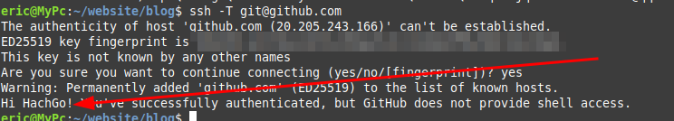

# install git

```shell
sudo apt-get install git
```

# install node.js

## install node.js with nvm

### install nvm

- nvm github url: https://github.com/nvm-sh/nvm#installing-and-updating

To **install** or **update** nvm, you should run the [install script](https://github.com/nvm-sh/nvm/blob/v0.39.5/install.sh). To do that, you may either download and run the script manually, or use the following cURL or Wget command:

```shell
curl -o- https://raw.githubusercontent.com/nvm-sh/nvm/v0.39.5/install.sh | bash
```

```shell
wget -qO- https://raw.githubusercontent.com/nvm-sh/nvm/v0.39.5/install.sh | bash
```

Running either of the above commands downloads a script and runs it. The script clones the nvm repository to `~/.nvm`, and attempts to add the source lines from the snippet below to the correct profile file (`~/.bash_profile`, `~/.zshrc`, `~/.profile`, or `~/.bashrc`).

```shell
export NVM_DIR="$([ -z "${XDG_CONFIG_HOME-}" ] && printf %s "${HOME}/.nvm" || printf %s "${XDG_CONFIG_HOME}/nvm")"
[ -s "$NVM_DIR/nvm.sh" ] && \. "$NVM_DIR/nvm.sh" # This loads nvm
```

result: because of the internet, the net can't connect the github, so it doesn't work!

## install node.js with the nvm

### install node with the repo

```shell
sudo apt-get update
```

```shell
curl -sL https://deb.nodesource.com/setup_16.x | sudo -E bash -
```

```shell
sudo apt-get install -y nodejs
```

# install hexo with npm

    first,you need to install npm, but i think it is installed in your linux system. you can check it with the command :

```shell
npm -v
```

later, install the hexo

```shell
sudo npm install -g hexo-cli
```

then init the blog at the folder which you choose :

```shell
hexo init /home/eric/website/blog/
```

install other developed packages 

```shell
npm install # install node_modules
```

# start the hexo

input the command :

```shell
hexo server
```

unput the url in the brower

http://localhost:4000/

and you will see this !

it's so wonderful !!!


# connect the github pages with the local file

## create the ssh key locally

```shell
ssh-keygen -t rsa -C "2717485875@qq.com"
```

tips: the email address is your account address


## copy the key in the menu

the menu : Settings->SSH and GPG keys->New SSH key->

firstly you should copy the key from your local path 

```shell
cat ~/.ssh/id_rsa.pub
```

and then enter the menu 

Settings->SSH and GPG keys->New SSH key->, and copy it in the test space, save it.

## test it locally

```shell
ssh -T git@github.com
```

if it works, it will show the comand like tihs ,and show your account name



# change the config file

open the config file in the root directory,open the _config.yml file and write it,

```yml
deploy:
  type: git
  repo: git@github.com:HachGo/HachGo.github.io
  branch: main
```

then save it.

# other config

## install a extension in the blog root directory

```shell
sudo npm i hexo-deployer-git
```

## add config for my git

```shell
git config --global user.email "you@example.com"
git config --global user.name "Your Name"
```

```shell
git config --global user.email "2717485875@qq.com"
git config --global user.name "HachGo"
```

# post the articles

firstly write a blog

```shell
hexo "new post"
```

then write it and post

```shell
hexo clean
```

```shell
hexo g
```

```shell
hexo deploy
```